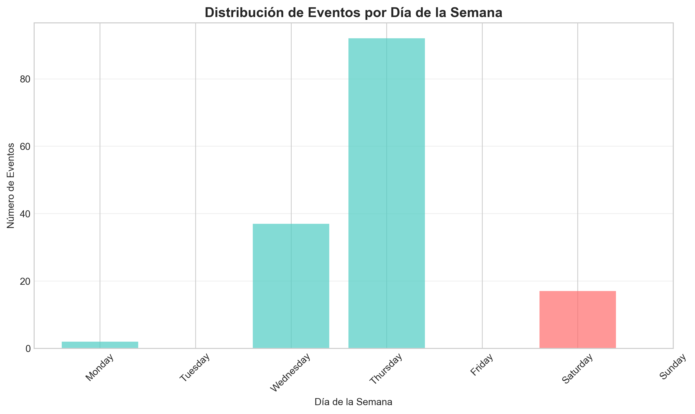

# Informe de Análisis Exploratorio de Datos (EDA)

**Fecha de generación:** 2025-10-25 02:02:09

---

## 1. Resumen Ejecutivo

- **Total de eventos registrados:** 148
- **Período analizado:** 2024-08-05 09:41:17 a 2025-10-25 01:03:27
- **Duración:** 445 días
- **Eventos con fotografía:** 135
- **Promedio de eventos por día:** 0.33

---

## 2. Análisis Temporal

---

## 3. Análisis de Fotografías

---

## 4. Conclusiones y Recomendaciones

1. Patrón temporal de eventos identificado
2. Distribución de eventos a lo largo del día y la semana
3. Proporción de eventos con evidencia fotográfica
